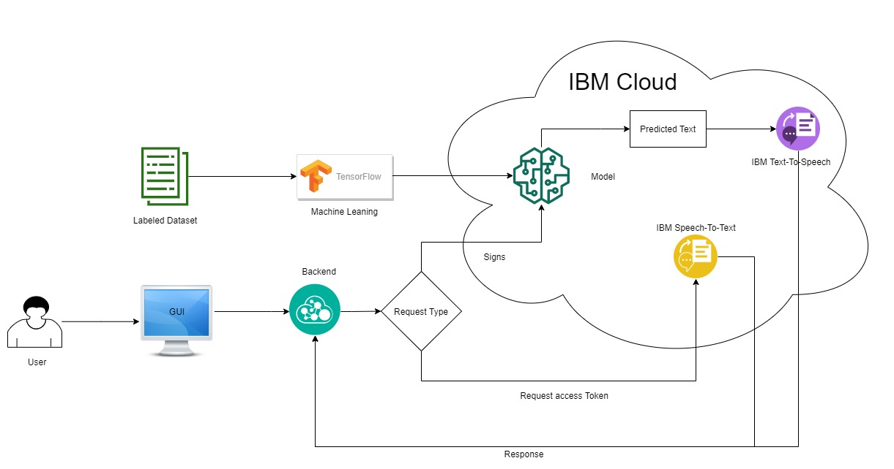

# Sign language Interpreter
## Abstract
Communication with people having speaking and hearing  disability is difficult for others. Day to day life tasks like ordering a coffee at cafe, interaction with people who does not have prior training to communicate with differently abled people, put the differently abled people in difficult situation. Other people need to get special training in sign language to communicate. This application can help people to communicate with them without having prior knowledge of sign language. It will be helpful to both groups of people.

This application will translate signs into text and speech to help people who cannot speak to communicate with other people. In addition to that, this application will also support speech to text conversion for people who don't have ability to hear.

## Goal 
 - To ease the communication with deaf and dumb people. 
 - To enable more people to communicate with differently abled people. 

## System Architecture

## Technologies 
 - Machine Learning using TensorFlow and Keras
 - OpenCV
 - IBM Watson text to speech
 - IBM watson speech to text
 - Python, Flask
 - Node.js, Express
 - React, Redux
 - Google firebase authentication
  
 ## Use cases 
  
This application can be useful at many places and personal use, e.g.
 - POS stations for order (Sign to speech for employees and speech to text for customer with hearing disability)
 - Enquiry stations (Sign to speech for employee and speech to text for customer with hearing disability)
 - Ticket counters (Sign to speech for employee and speech to text for customer with hearing disability)
 - Attending any seminar or lecture (live Speech to Text for person with hearing disability)
 - Bank teller desk(Sign to speech for employee and speech to text for customer with hearing disability)
