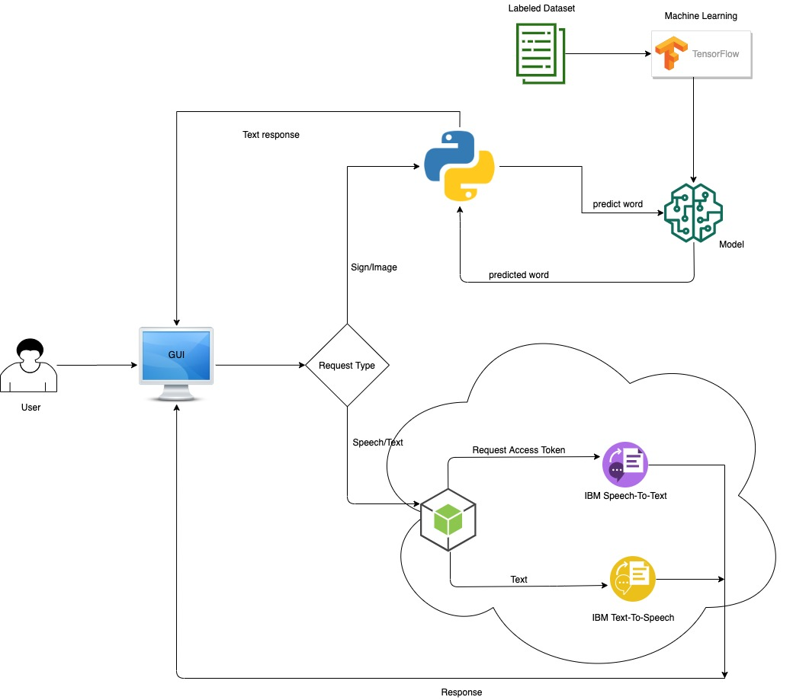

# Sign language Interpreter
## Abstract
There are around 1 million deaf and dumb people in the world. One of the biggest challenge faced by these people is communicating with those around them and vice- versa. There are many institutions throghout the world which facilitate these differently abled people. But that takes special training and effort. 
Our application can play a major role in this case.

This application will translate signs into text, so the differently abled people can communicate there thoughts easily to everyone. In addition to that, this application will also support speech to text conversion for people who do not have ability to hear.

## Goal 
 - To ease the communication with deaf and dumb people. 
 - To enable more people to communicate with differently abled people. 

## System Architecture

## Technologies 
 - Machine Learning using TensorFlow and Keras
 - OpenCV
 - IBM Watson text to speech
 - IBM watson speech to text
 - Python, Flask
 - Node.js, Express
 - React, Redux
 - Google firebase authentication
  
 ## Use cases 
  
This application can be useful at many places and personal use, e.g.
 - POS stations for order (Sign to speech for employees and speech to text for customer with hearing disability)
 - Enquiry stations (Sign to speech for employee and speech to text for customer with hearing disability)
 - Ticket counters (Sign to speech for employee and speech to text for customer with hearing disability)
 - Attending any seminar or lecture (live Speech to Text for person with hearing disability)
 - Bank teller desk(Sign to speech for employee and speech to text for customer with hearing disability)
 

